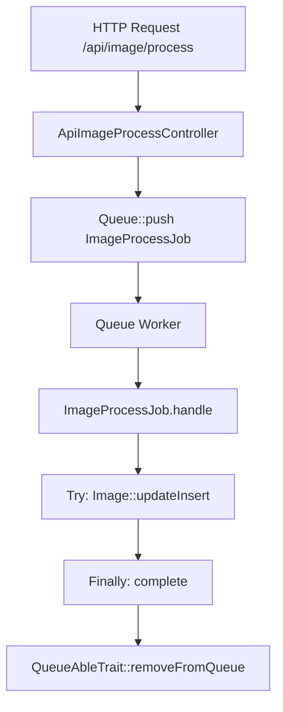

# Image Processing Request Flow

## Overview
This diagram shows the path of a request through the system, from the API endpoint to the final processing and queue cleanup.

---

## Detailed Component Documentation

### 1. Images
- **Command:** `sail artisan images:process dfotos .`
- **Controller:** `App\Http\Controllers\Api\ApiImageProcessController`
- **Job:** `App\Jobs\ImageProcessJob`
- **Action:** Calls `Image::updateInsert($data)` to create or update the image record.

### 2. Thumbnails
- **Command:** `sail artisan images:thumbnails --width=300 --height=200`
- **Controller:** `App\Http\Controllers\Api\ApiThumbnailProcessController`
- **Job:** `App\Jobs\ThumbnailProcessJob`
- **Action:** Generates thumbnail and updates `Image` record with path and dimensions.

### 3. Metadata
- **Command:** `sail artisan images:metadatas`
- **Controller:** `App\Http\Controllers\Api\ApiMetadataProcessController`
- **Job:** `App\Jobs\MetadataProcessJob`
- **Action:** Uses `exiftool` to extract metadata and saves it to the `Image` record.

### 4. Geolocation
- **Command:** `sail artisan images:geolocations`
- **Controller:** `App\Http\Controllers\Api\ApiGeolocationProcessController`
- **Job:** `App\Jobs\GeolocationProcessJob`
- **Action:** Extracts GPS coordinates from metadata, fetches address, and saves to `ImageGeolocationPoint`.

### 5. Faces
- **Command:** `sail artisan images:faces`
- **Controller:** `App\Http\Controllers\Api\ApiFaceProcessController`
- **Job:** `App\Jobs\FaceProcessJob`
- **Action:** Sends image to Face API, compares with known faces, and saves `Face` records.
